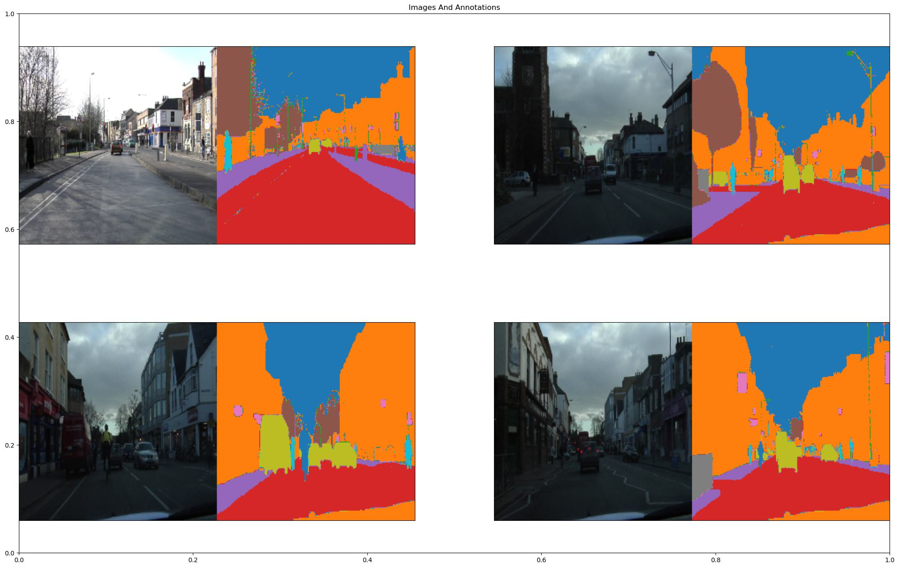
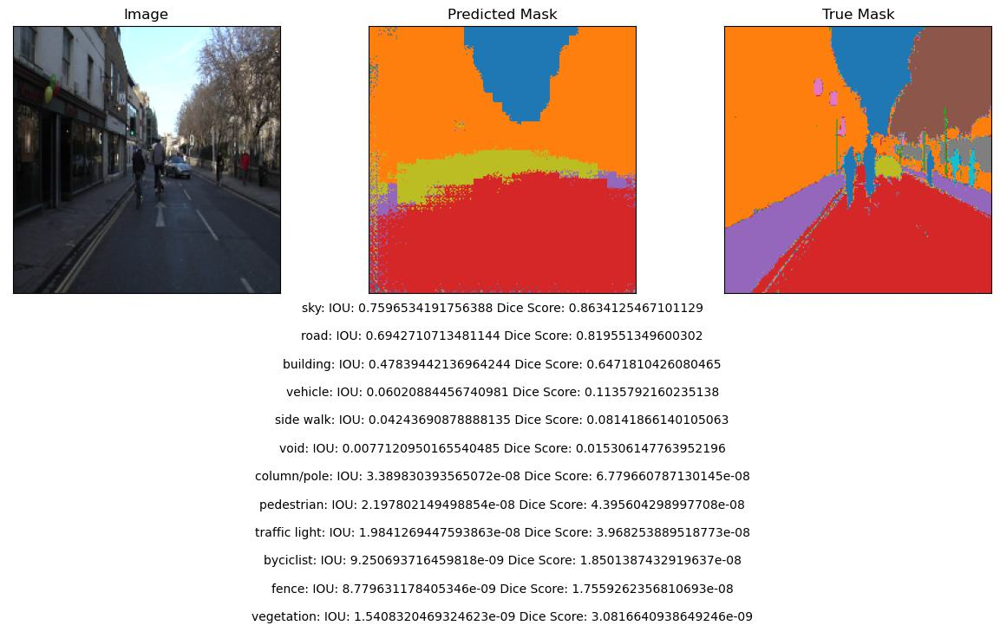

# Image_Segmentation
1. **VGG16 + FCN8** 
In the folder `VFF_FCN8`. This work uses `VGG16` from scratch as a `encoder` and `FCN8` as `decoder` to build a image segmentation model. The diagram of the network shown as,

  

The dataset uses [dataset1](https://drive.google.com/file/d/0B0d9ZiqAgFkiOHR1NTJhWVJMNEU/view?usp=sharing) prepared by [divamgupta](https://github.com/divamgupta/image-segmentation-keras). 

The dataset contains folders for images and annotations. The *images* contain the video frames while the *annotations* contain the pixel-wise label maps. Each label map has the shape `(height, width , 1)` with each point in this space denoting the corresponding pixel's class. Classes are in the range `[0, 11]` (i.e. 12 classes) and the pixel labels correspond to these classes 
`data_processing.py` contains functions of pre-processing dataset 
`image_processing.py` includes functions of image visulization.

Here is the example outlook of the dataset:

  

The `VGG16` weights can be downloaded from [VGG16_weight](https://github.com/fchollet/deep-learning-models/releases/download/v0.1/vgg16_weights_tf_dim_ordering_tf_kernels_notop.h5)

Here is the result after fitting the model with 170 epochs with 0.85 accuracy(IOU and Dice were calculated to indicate the performance):

  

2. **UNet**

3. **MaskNet**
